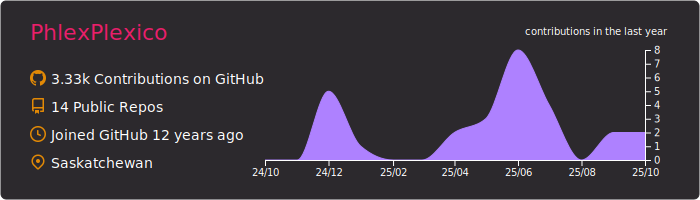
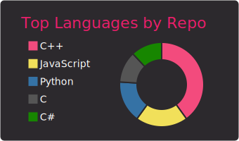

## PhlexPlexico

Site: [phlexplexi.co](https://phlexplexi.co)  
Hey there! I'm just a typical software developer from Canada. I usually spend my time in learning new (to me!) technologies and getting enough knowledge to get by. I'm a terrible designer so I just don't get front end frameworks, but that doesn't stop me from learning. I currently work on ERP systems for my job, but enjoy working with CS:GO, APIs, and some small work with 3DS hardware/software.  
If you would like, feel free to contact me on Twitter, email, or the various socials on my site! I'm always willing to help as much as I can! 🤙

